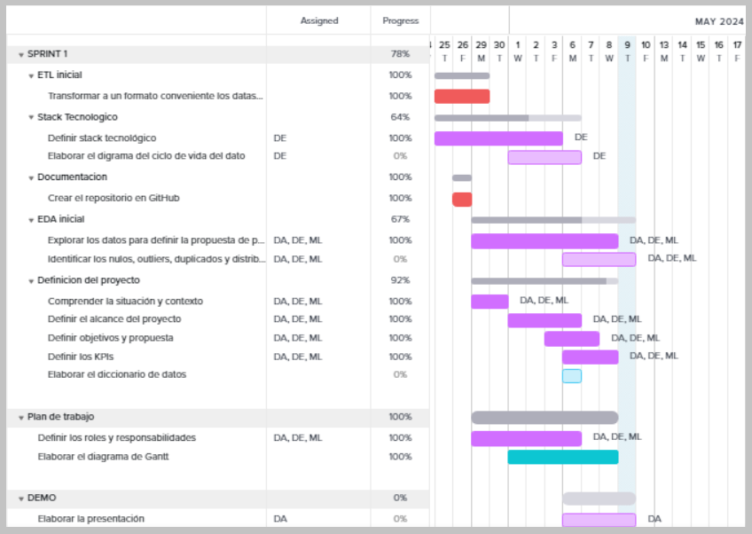
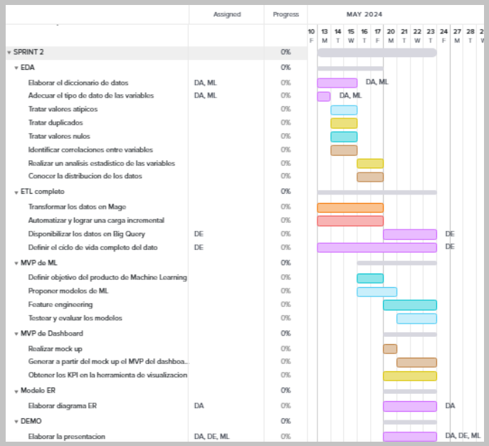
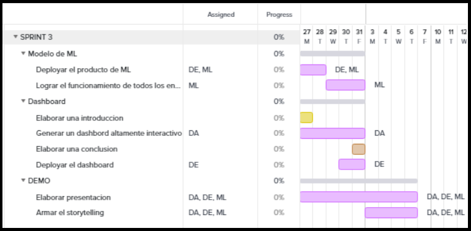
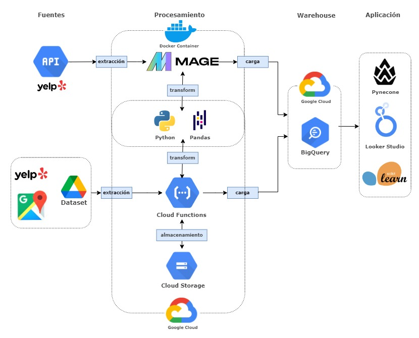

    

## Descripción del Proyecto

Este proyecto se enfoca en el analisis exploratorio de datos para la cadena de restaurantes Darden Continuing Operations, donde analizaremos su restaurante  y por medio de un analisis de la informacion y con una propuesta de trabajo definiendo Kpi's buscaremos la manera de mejorar sus calificaciones en las plataformas de recomendaciones como Google y Yelp.

## Descripción del Conjunto de Datos

El conjunto de datos utilizado en este análisis contiene información sobre comentarios que los usuarios de google dejan sobre los establecimientos a los que la app de Google_Maps evidencia que estuvieron, si estos usuarios dejan sus calificaciones y comentarios, tambien existe una metadata la cual contiene toda la informacion acerca de los establecimientos, la cual nos fue util para identificar a que establecimiento hacia referencia el usuario.

## Objetivo

Potenciar la visibilidad y reputación de las marcas del grupo empresarial Darden en la región de Filadelfia y sus alrededores a través de la plataforma Yelp.

# Equipo de trabajo
<h1 align="center">Data Engineering</h1>

  

    
    <h3>Felix Santana</h3>
  

  

    
    <h3>Jonathan Gutiérrez</h3>
  

<h1 align="center">Data Analytics</h1>

  

    
    <h3>Catalina Castelblanco</h3>
  

  

    
    <h3>Andres Mozo</h3>
  

<h1 align="center">Machine Learning</h1>

  

    
    <h3>Facundo Sagle</h3>
  

  

    
    <h3>Marcelo Trinkard</h3>
  
  

## Plan de trabajo

Por medio de la metodologia SCRUM nos organizamos en equipo repartiendo el trabajo de la siguiente manera.

Para diagramar y organizar las tareas a realizar, elaboramos un diagrama de Gantt, en donde se indica el responsable mediante el color de la barra, si tiene a cargo un sector o un conjunto de sector el color será violeta, indicándose que sectores están involucrados, por otra parte, si está a cargo de una única persona en este grafico podemos identificar quien es quien debe realizarla. La extensión y ubicación de la barra indica el periodo de tiempo destinado para esta tarea. 

# Sprint 1
Como se observa, el primer sprint fue destinado principalmente a poner en marcha el proyecto y hacer un análisis preliminar de los datos y las tecnologías a utilizar.

    

# Sprint 2
En el segundo sprint los roles van a ser fundamentales, ya que a diferencia del primero que era más general, ahora cada sector tendrá tareas más específicas y relacionadas al rol definido. Sin embargo, al ser el objetivo principal de este sprint finalizar la infraestructura del proyecto, debe tratarse de forma prioritaria y los demás sectores deben  brindar soporte de ser necesario.

    

# Sprint 3

En el tercer sprint se busca tener los modelos de ML y el dashboard listo en la primera semana para que en la segunda semana se pueda hacer un correcto storytelling y una presentación más elaborada que las anteriores.

    

## Flujo de datos

    

## Analisis de los datos
- [`EDA_preliminar_Google.ipynb`](notebooks/eda_google.ipynb)
: Jupyter Notebook que contiene el código y la narrativa del análisis exploratorio de datos en el archivo de reviws suministrado por Google.
- [`EDA_preliminar_YELP.ipynb`](notebooks/eda_yelp.ipynb)
: Jupyter Notebook que contiene el código y la narrativa del análisis exploratorio de datos de los archivos de YELP

## Tecnologias Utilizadas

