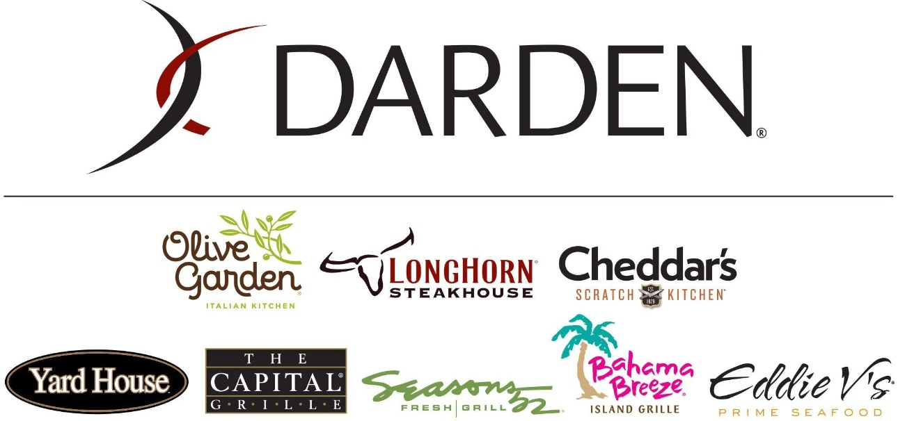
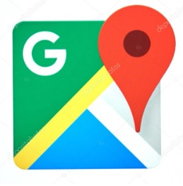
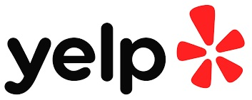

&nbsp;

  

&nbsp;

<h1 align='center'>
 <b>  Potenciación de la Visibilidad y Reputación de las Marcas Darden </b>
</h1>

  

&nbsp;

## Descripción del Proyecto

Nos complace anunciar una emocionante colaboración entre Darden, la mayor empresa de restaurantes de servicio completo en Estados Unidos, e Insight Latinamerica.

En Darden, la excelencia en el servicio y la pasión por deleitar a más de un millón de clientes cada día son fundamentales. Con un compromiso inquebrantable hacia sus miembros del equipo y las comunidades que sirven, Darden cuenta con un portafolio de nueve marcas icónicas que destacan en el mercado. En un mundo donde las expectativas sobre las empresas son cada vez mayores, especialmente en temas Ambientales, Sociales y de Gobernanza (ESG), Darden se esfuerza por marcar una diferencia significativa.

En Insight Latinamerica, estamos encantados de asociarnos con Darden para alcanzar este ambicioso objetivo . Con nuestra experiencia en estrategias de marketing digital y gestión de reputación, utilizaremos la plataforma Yelp para aumentar la visibilidad de sus marcas, mejorar la interacción con los clientes y fortalecer su presencia en la comunidad local.

Nuestro enfoque estratégico en Yelp nos permitirá:

Incrementar la visibilidad de las marcas de Darden: Optimizando los perfiles y implementando estrategias de marketing digital, aseguraremos que más clientes potenciales descubran y elijan los restaurantes de Darden.

Mejorar la reputación online: Gestionaremos activamente las reseñas y comentarios de los clientes para mantener y elevar la percepción positiva de las marcas.

Fortalecer la lealtad del cliente: Al interactuar de manera más efectiva con los clientes, no solo responderemos a sus necesidades y preocupaciones, sino que también crearemos una comunidad de clientes leales y satisfechos.

Contribuir al desarrollo local: Darden continuará siendo una fuerza positiva en Filadelfia, participando en iniciativas comunitarias y abordando problemas locales en los que puede tener un impacto significativo.

Estamos entusiasmados por esta oportunidad de trabajar con Darden y confiamos en que esta iniciativa contribuirá a la creación de valor a largo plazo para sus accionistas, a la vez que refuerza su compromiso de servicio a sus clientes y comunidades. Invitamos a todos a seguir de cerca este proyecto y a acompañarnos en este viaje hacia una mayor excelencia y reconocimiento en el mercado.

## Objetivo General

### Potenciar la visibilidad y reputación de las marcas del grupo empresarial Darden en la región de Filadelfia y sus alrededores a través de la plataforma Yelp.

## Descripción del Conjunto de Datos

El conjunto de datos utilizado en este análisis contiene información sobre las "reseñas" que los usuarios de las plataformas Google Maps y Yelp dejan sobre los establecimientos a los que asisten. Y toda la metadata referente a estos establecimientos, como ubicación, horarios de apertura y cierre, y características varias como infraestructura, servicios, ambiente, etc.

  
  

## Plan de trabajo

Por medio de la metodologia SCRUM nos organizamos en equipo repartiendo el trabajo de la siguiente manera:

Elaboramos un diagrama de Gantt, en donde se indica el responsable de cada tarea mediante el color de la barra. Si la tarea está a cargo de más de una persona, el color de la barra será violeta. La extensión y ubicación de la barra indica el periodo de tiempo destinado para esta tarea.  

### Sprint 1

Como se observa, el primer sprint fue destinado principalmente a poner en marcha el proyecto y hacer un análisis preliminar de los datos y las tecnologías a utilizar.

  

### Sprint 2

En el segundo sprint los roles van a ser fundamentales, y cada sector tendrá tareas más específicas y relacionadas al rol definido. Sin embargo, al ser el objetivo principal de este sprint finalizar la infraestructura del proyecto, el sector de ingeniería de datos tendrá un rol prioritario y los demás sectores deben  brindar soporte en caso de ser necesario.

  

### Sprint 3

En el tercer sprint se busca tener los modelos de machine learning y el dashboard listos, haciendo foco en el story telling y en lograr presentación más que integre todo el proyecto de manera completa, concisa y profesional.

  

&nbsp;

## Pipeline - El camino de datos

  

&nbsp;

## Analisis de los datos
- [`EDA_preliminar_Google.ipynb`](notebooks/eda_google.ipynb)
: Jupyter Notebook que contiene el código y la narrativa del análisis exploratorio de datos en el archivo de reviws suministrado por Google.
- [`EDA_preliminar_YELP.ipynb`](notebooks/eda_yelp.ipynb)
: Jupyter Notebook que contiene el código y la narrativa del análisis exploratorio de datos de los archivos de YELP

## Dash board Intercativo

  

## Bot reviews Darden 

  

## Tecnologias Utilizadas

