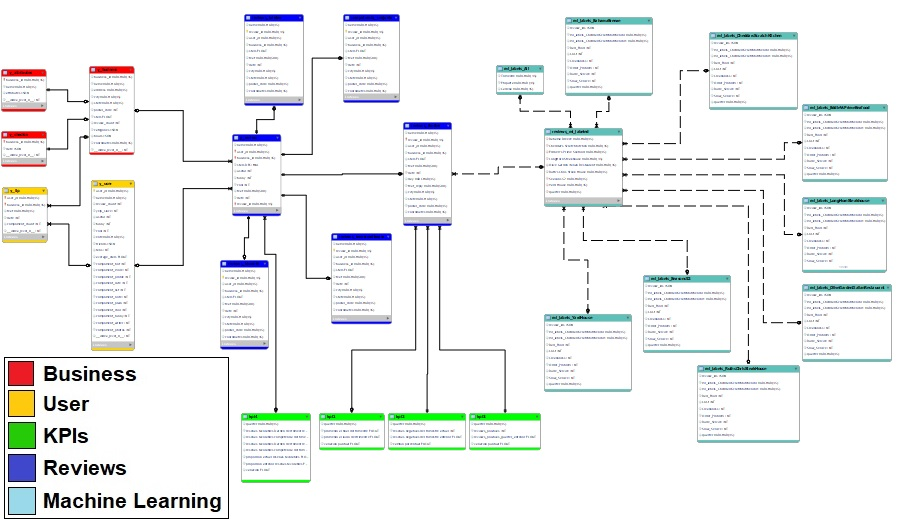
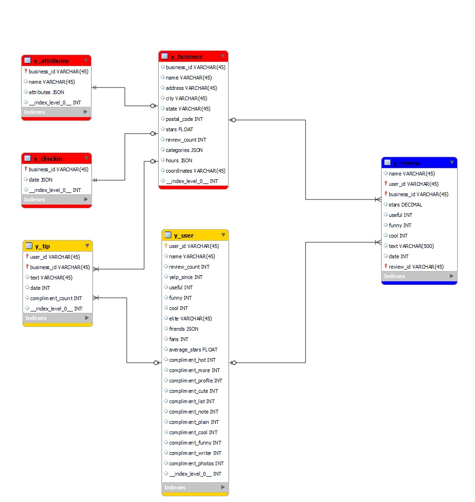
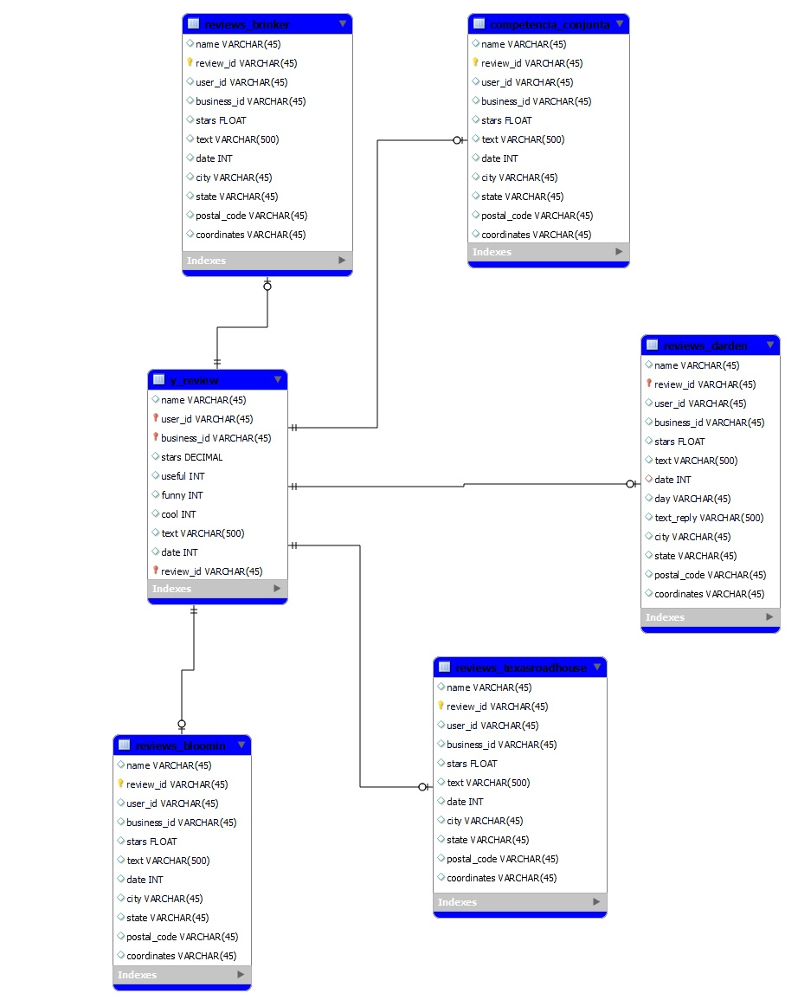
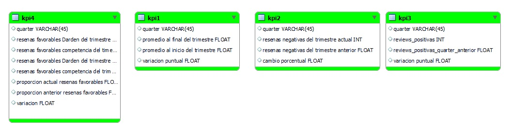
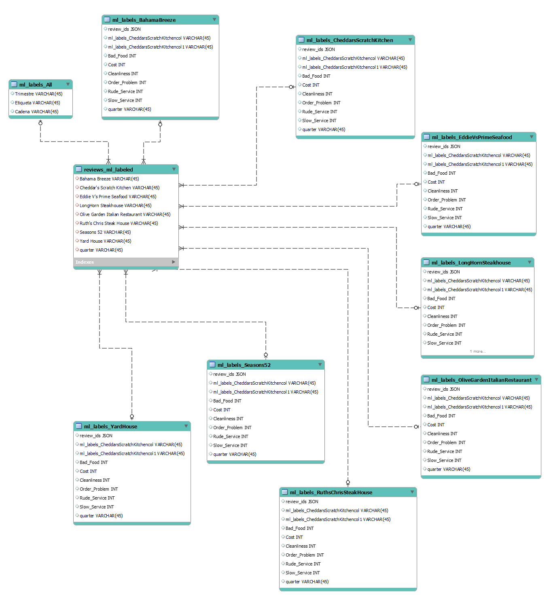

# Estructura Base de Datos

## Overview
Este documento describe la organización de tablas dentro de la Base de Datos de nuestro warehouse, que se ubica dentro del sector de Big Query en Google Cloud Platform.

### Esquema Global

A continuación se muestra el esquema global de la base de datos. La evolución de la BD o creación de tablas se puede considerar de izquierda a derecha en el gráfico. Arrancando por la materialización de tablas conforme se procesaron los datos de origen provenientes de Yelp, la posterior creación de tablas para el análisis de las reviews y finalmente la creación de tablas específicas para los procesos de machine learning y la medición de indicadores.
La simbología de colores refiere a grupos de tablas relacionadas al mismo contexto. Si el vínculo entre tablas es de línea sólida indica que se puede realizar consultas. En el caso de líneas de trazo, indica que las tablas fueron creadas desde la tabla de partida, y aplicando funciones, pero no se puede relacionar los datos mediante una consulta.

    

### Datos provenientes de YELP

Las tablas del esquema siguiente se crean con los datos del dataset original, y con los datos de consumo de la API de YELP.

    

### Desagregación de Reseñas

Con el objetivo de facilitar la presentación de datos en el dashboard generado en Looker Studio, se procedió a desagregar las reviews y agruparlas por cadena de restaurants en base a los objetivos del proyecto.

    

### Indicadores de Performance (KPI)

Para el seguimiento de los KPI del proyecto se generaron las tablas que contienen los datos a mostrar por los gráficos del tablero de KPIs.

    

### Modelos de Machine Learning

Todos los procesos generados con las librerías de machine learning son almacenados en nuevas tablas, y lo mismo ocurre con los datos que necesita leer el dashboard de ML, almacenados en tablas destinadas a tal fin.

    

