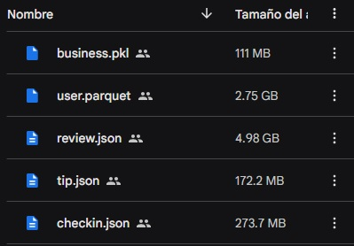
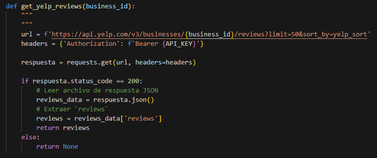
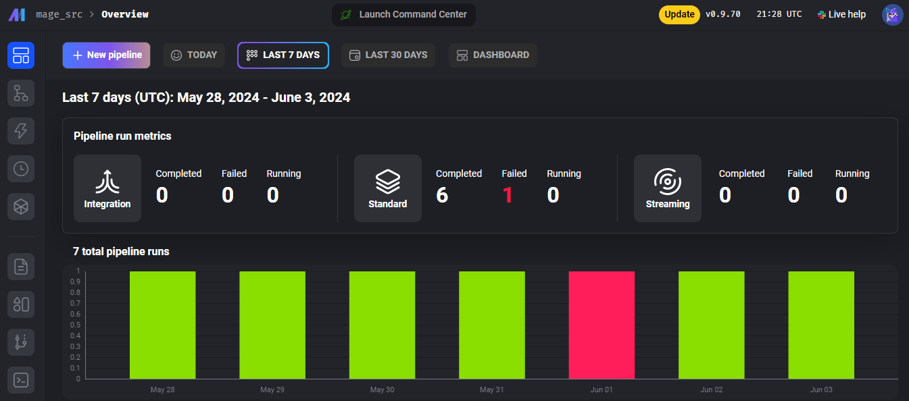
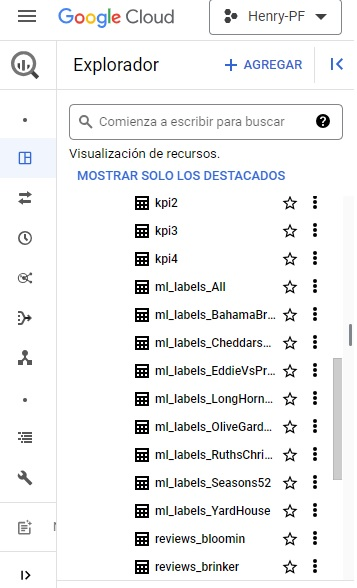

# El Camino de los Datos

## Overview

Este documento describe el camino que recorren, y los precesos que reciben los datos, desde su obtención hasta su disposición final en el warehouse, para ser utilizados.  
El proyecto implementa una arquitectura híbrida de ETL (Extracción, Transformación y Carga) para extraer y procesar datos de diversas fuentes, utilizando BigQuery como data warehouse central del proyecto. Se compone de dos pipelines principales: uno gestionado localmente y otro automatizado mediante Mage.ai.

### Esquema Global

A continuación se muestra el esquema global del pipeline.

    

Como se puede apreciar, los datos se reciben desde dos fuentes distintas, un dataset inicial para analizar la factibilidad y alcances del proyecto, y un consumo de datos desde la API de Yelp.

## Camino del Dataset inicial

Los archivos fueron recibidos en formato Parquet y Json, desde un Drive compartido.  

    

El pipeline ETL local se encarga de extraer datos del Google Drive compartido, transformarlos según las necesidades del negocio y cargarlos en tablas específicas en BigQuery. Los datos se almacenan en formato Parquet en Google Cloud Storage, que actúa como nuestro data lake.

    

## Pipeline dinámico actual

Actualmente el camino de los datos comienza con su obtención, mediante el consumo de la API de la plataforma YELP. 

    

La gestión del flujo automatizado de trabajo, que comprende la ejecución del script de consumo del API, el procesado de los datos, la verificación de que no haya reseñas que ya hayan sido recibidas, y el envío de las reseñas nuevas a BigQuery, son orquestados por Mage.Ai.

    

### BigQuery

Finalmente, el lugar al que llegan todos los archivos, es BigQuery. Dentro de la plataforma se encuentran todas las tablas iniciales, y las tablas originadas para los distintos procesos de visualización y análisis.

    

#### Tecnologías Utilizadas

- Python
- Bibliotecas de manejo de datos: Pandas y Dask
- Google Cloud SDK para interactuar con Cloud Storage y BigQuery
- Google Cloud Function, vía triggers por HTTP
- Mage.ai para la automatización del pipeline
- API de Yelp para la extracción de datos
