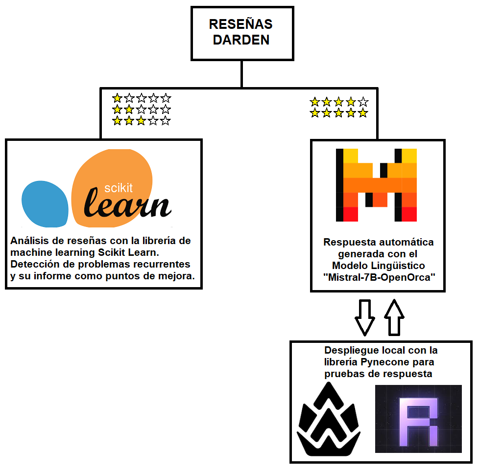

## Análisis y manejo de reseñas con herramientas de Machine Learning 

La propuesta de mejora de la imagen del grupo Darden en Yelp, incluye el tratamiento de reseñas. Inicialmente se van a clasificar las reseñas según la calificación en estrellas que tenga cada una de ellas, para luego abordarlas según el siguiente criterio: Las reseñas positivas van a ser respondidas automáticamente por un Bot de respuesta. Las reseñas negativas van a ser analizadas para determinar puntos de mejora y luego serán respondidas de manera manual por personal de Darden. Se anexa a continuación un gráfico que resume el flujo de las reseñas:

    

### Reseñas Positivas:

Para generar las respuestas automáticas a las reseñas positivas, después de varias pruebas y una investigación intesiva, se determinó que se podía implementar un modelo lingüistico grande, o "LLM" (Large Language Model) en inglés.  
Estos modelos, desarrollados por las compañías líderes del mercado, ofrecen muchas variantes ajustadas con propósitos específicos "Fine Tune", realizadas por usuarios especializados y disponibles abiertamente para su utilización.  
En nuestro caso se optó por elegir el modelo Mistral-7B como base, y para no trabajar con el modelo completo, debido a que no se necesitan todas sus cualidades y también para reducir requisitos de cómputo, se optó por la versión "mistral-7b-instruct-v0.2.Q5_K_M.gguf", tuneada por el usuario popular "TheBloke", o también "Tom Jobbins" en las redes. La versión "K_M" demanda 5.13GB de disco y 7.63GB de RAM, frente a los más de 15GB de disco y demandas de 30GB a 90GB de RAM, de un modelo Mistral completo, y en este caso, literalmente del autor "very low quality loss".  
La extensión GGUF de los modelos los hace compatibles con la librería "ctransformers" de Python, que es la utilizada en este proyecto.  
Finalmente, para mostrar y testear el modelo, se realizó un despliegue en un servidor propio, utilizando la librería Pynecone.  

### Reseñas Negativas

Para identificar aspectos negativos en las reseñas de restaurantes, se utilizó un conjunto de datos con más de 1500 reseñas clasificadas en 8 categorías distintas:
1.	BadFood: Insatisfacción con la calidad de la comida.
2.	Cost: Descontento con el precio de los platos.
3.	Filthy: Desagrado por la limpieza del establecimiento.
4.	MissingFood: Falta de disponibilidad de ciertos platos.
5.	OrderProblem: Errores en la toma de pedidos.
6.	RudeService: Mal servicio al cliente.
7.	BadNeighborhood: Ubicación del restaurante en una zona poco atractiva.
8.	SlowService: Demoras excesivas en el servicio.
Se experimentó con diversas configuraciones y modelos de clasificación múltiple utilizando la librería ScikitLearn, dado que una reseña puede contener más de un aspecto negativo. Se optó por un modelo de máquina de vectores de soporte (SVM) en conjunto con OneVsRestClassifier para facilitar la clasificación múltiple. Es crucial destacar que el modelo incluye un proceso de preprocesamiento mediante TfidfVectorizer, una herramienta de procesamiento de lenguaje natural (NLP) que transforma un conjunto de documentos en una matriz de características TF-IDF, asignando un peso a las palabras según su importancia en un documento y en el conjunto total de datos.
Posteriormente, se propusieron diferentes hiperparámetros y, mediante GridSearchCV, se encontró la combinación óptima para mejorar el rendimiento del modelo. Para evaluar el modelo de aprendizaje automático, se utilizó el F1 Score, una métrica que integra precisión y sensibilidad (recall), ofreciendo un equilibrio entre ambas, lo cual resulta particularmente útil cuando las clases están desbalanceadas. El F1 Score obtenido con la mejor combinación de hiperparámetros fue de 0.59.
El modelo, entrenado con reseñas de otros restaurantes, sirve para predecir problemas asociados a las reseñas de los restaurantes de Darden (o de cualquier otro restaurante). Al recibir una reseña, el modelo produce una lista de 8 elementos binarios, cada uno representando la presencia o ausencia de uno de los problemas mencionados. Por ejemplo:
Reseña: “Good steaks but a little overpriced. More expensive than Outback.” Salida del modelo: [0 1 0 0 0 0 0 0]
La salida indica que el cliente encontró los precios del restaurante problemáticos, lo cual es acorde con el contenido de la reseña. Es importante señalar que el orden de los problemas en la salida corresponde al orden en que se presentaron inicialmente.

