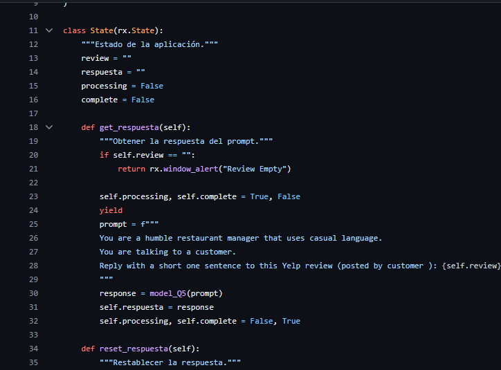

# Implementación de Bot para Responder Reviews para Darden

Este documento describe la creación e implementación de un bot para responder a las reviews de clientes para nuestro cliente Darden y sus diferentes marcas. La implementación utiliza la librería `ctransformers` y un modelo de lenguaje específico.

## Dependencias

Para esta implementación, usamos la librería `ctransformers` y el modelo `Mistral-7B-OpenOrca-GGUF`.

  

  

## Definición del Estado de la Aplicación

Creamos una clase State que maneja el estado de la aplicación. Esta clase incluye métodos para obtener y restablecer respuestas basadas en reviews de clientes.

  

## Pantalla de Bienvenida

Definimos una función welcome para mostrar la pantalla de bienvenida.

  

## Pantalla Principal para Generar Respuestas

Definimos una función index que representa la pantalla principal donde los usuarios pueden ingresar una review y obtener una respuesta generada por el modelo.

  

## Configuración de la Aplicación

Finalmente, configuramos la aplicación, añadiendo las páginas de bienvenida y de generación de respuestas.

  

